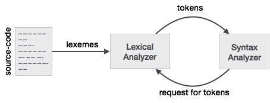

# GOLD-Parsing-System
Use [`GOLD Parser Builder setup`](http://www.goldparser.org/builder/index.htm) to analyze a grammar and create the Compiled Grammar Table file used by the different implementations of the Engine.

## How It Works


## What is the difference between a token and a lexeme ?


### Example:-

  START x=5; END

```sh
    Lexeme           Token
    START            SYMBOL_START
     x               SYMBOL_ID
     =               SYMBOL_EQ
     5               SYMBOL_DIGIT
     ;               SYMBOL_SEMI
    END              SYMBOL_END
 ```

## Parse Tree
```sh
    Root <program> ::= Start <stmt_list> End
    level1      START
    level1      <concept>
    level2      <assign>
    level3      <id>, '=', <expr>, ';'
    level4      Id
    level5      x
    level4      =
    level4      <term>
    level5      <factor>
    level6      <exp>
    level7      <digit>
    level8      Digit
    level9      5
    level4      ;
    level1      END

 ```

## 📝 Notes

- [Calitha C# Engine](http://www.goldparser.org/engine/1/net/van-loenhout/index.htm)
- [.NET DLL](http://www.goldparser.org/engine/5/net/index.htm)
